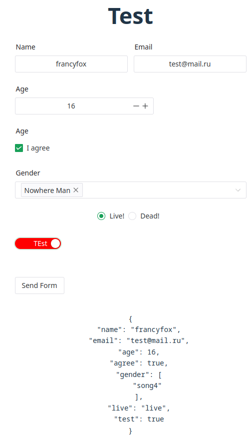

# FN-Scheme
#### Form schema component for Naive UI framework. Generate form from json like formkit schema component

P.S. alternative @chronicstone/vue-sweetforms

- Package type: `es`


#### TREE
- [How to use](#how-to-use)
- - [Test schema](#json-test-scheme)
- [Available components](#available-components)
- [Changelog](#changelog)
- [TODO](#todo)

### How to Use

Install command

```shell
pnpm i @francfox/fn-forms
```

Import component

```vue

<script setup type="ts">
import { FnSchema, NaiveUISchema } from '@francyfox/fn-forms'

const formData = ref()
const json = {
  $type: 'n-form',
  children: []
} as NaiveUISchema
</script>

<template>
  <fn-schema v-model:data="formData" :schema="TestSchema"/>
</template>
```

1. Json start with form wrapper (`$type: 'form'`)
2. In children create our form elements

##### JSON API

- `$type` equal component name (like <n-form>)
- `$prop` equal component props
- `$children` equal component slot. U can use string for default slot, array for children (h - render functions) 
  json elements or object with slot functions `{ default: () => 'button text'}`

If you want set data in props (value, checked) use string `$data`. Simply `$data.user.name` converted to -> 
`formData.user.name`, formData gets from v-model:data

##### Supported alias

- `$data` equal v-model:data (only in value, checked props)
- ...

##### Json test scheme
```ts
[
    {
        $type: 'n-form',
        $children: [
            {
                $type: 'n-space',
                $children: [
                    {
                        $type: 'n-form-item',
                        $props: {
                            label: 'Name',
                            path: 'user.name',
                        },
                        $children: [
                            {
                                $type: 'n-input',
                                $props: {
                                    placeholder: 'Input Name',
                                    value: '$data.user.name',
                                },
                            },
                        ],
                    },
                    {
                        $type: 'n-form-item',
                        $props: {
                            label: 'Email',
                            path: 'user.email',
                        },
                        $children: [
                            {
                                $type: 'n-input',
                                $props: {
                                    type: 'email',
                                    placeholder: 'Input Email',
                                    value: '$data.user.email',
                                },
                            },
                        ],
                    },
                ],
            },
            {
                $type: 'n-form-item',
                $props: {
                    label: 'Age',
                    path: 'user.age',
                },
                $children: [
                    {
                        $type: 'n-input-number',
                        $props: {
                            placeholder: 'Input age',
                            clearable: true,
                            value: '$data.user.age',
                        },
                    },
                ],
            },
            {
                $type: 'n-form-item',
                $props: {
                    label: 'Age',
                    path: 'user.agree',
                },
                $children: [
                    {
                        $type: 'n-checkbox',
                        $children: 'I agree',
                        $props: {
                            placeholder: 'Agree?',
                            value: '$data.user.agree',
                        },
                    },
                ],
            },
            {
                $type: 'n-form-item',
                $props: {
                    label: 'Gender',
                    path: 'user.gender',
                },
                $children: [
                    {
                        $type: 'n-select',
                        $children: 'I agree',
                        $props: {
                            multiple: true,
                            value: '$data.user.gender',
                            options: [
                                {
                                    label: 'Nowhere Man',
                                    value: 'song4',
                                },
                                {
                                    label: 'Think For Yourself',
                                    value: 'song5',
                                },
                            ],
                        },
                    },
                ],
            },
            {
                $type: 'n-radio-group',
                $props: {
                    value: '$data.user.live',
                    name: 'state'
                },
                $children: [
                    {
                        $type: 'n-radio',
                        $children: 'Live!',
                        $props: {
                            value: 'live',
                        },
                    },
                    {
                        $type: 'n-radio',
                        $children: 'Dead!',
                        $props: {
                            label: 'Dead!',
                            value: 'dead',
                        },
                    },
                ],
            },
            {
                $type: 'n-form-item',
                $children: [
                    {
                        $type: 'n-switch',
                        $children: {
                            checked: () => 'TEst',
                            unchecked: () => 'NonTest'
                        },
                        $props: {
                            value: '$data.user.test',
                            railStyle: () => 'background: red'
                        }
                    }
                ]
            },
            {
                $type: 'n-form-item',
                $children: [
                    {
                        $type: 'n-button',
                        $children: 'Send Form',
                    },
                ],
            },

        ],
    },
]
```

```ts
const formData = ref({
  user: {
    name: 'francyfox',
    email: 'test@mail.ru',
    age: 16,
    agree: true,
    gender: ['song4'],
    live: 'live',
    test: false
  },
});
```



#### Available components:
```markdown
  Form = 'n-form',
  Input = 'n-input',
  InputNumber = 'n-input-number',
  FormItem = 'n-form-item',
  Button = 'n-button',
  Space = 'n-space',
  Select = 'n-select',
  Checkbox = 'n-checkbox',
  Radio = 'n-radio',
  RadioGroup = 'n-radio-group',
  Switch = 'n-switch',
  DynamicTags = 'n-dynamic-tags',
  Upload = 'n-upload',
  UploadDnd = 'fn-upload-dnd'
```

#### CHANGELOG

##### v0.1.0

- fix import error

##### v0.0.2

- Remove from npm compiled js dist and assert ts folder

#### TODO:
